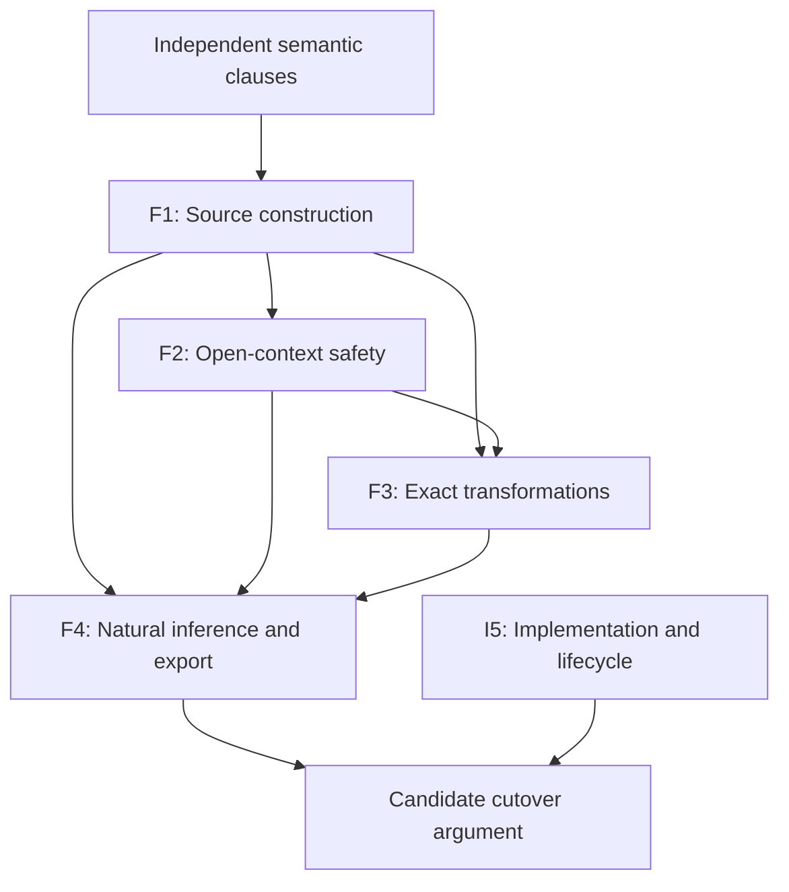

# Successor production proof architecture: construction before reconstruction

Date: 2026-10-07
Status: Reviewed; architecture audit, not semantic adoption or theorem closure
Scope: successor proof planning on `research/simple-sub-intrusion`
Audit baseline: `911204e1b1d4455077829440b16eab32c7a64d09`
Revalidated remote HEAD: `7bf7083419f677eacaf1b76525ce4c06bc2da908`
Reviewed-by: independent compiler-referee and spec-auditor; fresh compiler-referee repair delta
Review record: [proof-economy review](../progress/2026-10-07-successor-proof-economy-review.md)
Requested-by: user's current global proof-surface audit instruction
Approved-by: no new semantic or production decision
Supersedes: no Authoritative contract and no canonical theorem statement
Implementation authority: none; production cutover remains prohibited

## 1. Result and limits

The production argument should have **four semantic theorem families and one
implementation/lifecycle invariant**, not ninety independently scheduled
proof problems. The families below have explicit constructor, simulation,
transformation and source-derivation induction cases. Each case owns its
facts once; later projections do not open another semantic problem.

This is an independently reviewed architecture target, **not a
claim that the four theorems are proved or that only four atomic lemmas remain**.
Some original interpretation clauses have not been defined. A proof model
cannot prove their introduction from an inventory that never specifies them.
Those clauses belong in a small, explicit semantic-constructor design packet,
followed by its correctness proof, rather than in another chain of transport
lemmas. The concrete production membership/admission rules also remain open.

The [exhaustive audit](../progress/2026-10-07-successor-proof-surface-audit.md)
and its [machine table](../progress/2026-10-07-successor-proof-surface-audit.json)
cover every non-CLOSED canonical node and the major internal cuts. The
[Pro handoff](../theory/2026-10-07-successor-pro-theorem-handoff.md) gives the
four exact target families. The current canonical DAG keeps all ninety nodes,
196 edges, statuses, premises, and production-relevance fields unchanged.
It records the existing sufficient route; this document gives an alternate
route and the conditions under which a later review could use it.

The reduction is substantive in three places:

1. **Generated evidence has one introduction and one preservation proof.**
   Owner/slot lookup, emitted attachment access, emitted license access and
   profile-entry lookup become elimination/projection cases of that result.
   They are not separately reconstructed from solved endpoints.
2. **Safety uses the actual compiled object and the independently specified
   production relation.** It does not require every production observation to
   reconstruct a source execution, nor an equality between a second generated
   world relation and the entire approved context domain.
3. **Natural inference uses independent source-derivation completeness and
   factorization through the actual export.** A universal characterization of
   arbitrary independently semantic-valid views is a separate research target.
   This separation is valid only if the narrower theorem covers every
   approved ordinary source contract and refinement; it is not permission to
   replace principality by selected successful examples.

## 2. Authority: what the smaller route must still prove

| Source and exact section | Binding requirement | Consequence for this audit |
| --- | --- | --- |
| [Design authority](../../rules/design-authority.md), Natural compiler behavior and proof-obligation economy | Class 3 is not automatically a cutover prerequisite; current gates keep status until a reviewed discharge/unnecessariness argument. | Audit sufficient-route dependencies; do not remove them by relabeling. |
| [Charter](2026-09-29-scc-intrusion-redesign-charter.md) §§2,9,11 | Soundness and principality are mandatory; principality is relative to the declared conservative abstraction. | Preserve most-general source solutions and final ordinary acceptance. The charter is Reviewed, with separately recorded user directions; do not mislabel it wholly Authoritative. |
| [Inferred Function views](2026-10-05-inferred-function-call-views.md) §2 | One shared source contract, stable slots, typed source paths, original jointly scoped `nu,K,D`, formation independent of `Q`. | Constructors must establish these facts; success and shape cannot establish them. |
| Same Authoritative document §5.4 | “The required uniqueness or principality result for completed contracts and profiles”. | Some principality result remains before implementation. No sentence here specifies every arbitrary independently semantic-valid public scheme as its exact quantifier. |
| Same document §5.5 | Exhaustive comparison-independent Option A/2 membership/admission; `D_C ⊆ D_A` and `P_A ⊆ P_C` on every checked-admitted challenge, including production-only members. | Exhaustiveness, actual descriptor realization and both inclusions are A, even when their quantifiers are universal. |
| [Approved inlet domain](../../questions/2026-10-05-production-function-inlet-context-domain/approved-answer.md), decisions 1–3 | All independently typed compatible punctured caller contexts, including other-program and future reuse; whole holes and original correlations. | No reachable-only, closed-world or sampled-domain replacement. |
| [Approved Option 2](../../questions/2026-10-05-production-function-bound-membership/approved-answer.md), decisions 1–4 | Production observations need not have source-constructor witnesses; concrete exhaustive rules remain unselected. | Keep extras and their independent containment proof; do not define production as the source certificate image. |
| [Callback delivery](2026-10-03-callback-context-delivery.md) and Function views §1 | Normative B; scheduling optimizations preserve acceptance, principal solutions, choices and evidence. | Phase reorganization is not permission for a weaker callback rule. |
| [Principal scheme criteria](../progress/2026-10-04-principal-scheme-acceptance-criteria.md) | General rules derive the accepted ordinary presentations and solution families. | `id`, `zero`, `call`, `compose`, `twice`, `choose`, `higher` remain criteria, not per-program special cases. |

The exact arbitrary-view formulation in `ALL_VIEW` and the full backward
characterization in `SOURCE_ADEQUACY` occur in research theorem targets and
sufficient-route navigation. No inspected Authoritative sentence requires
those exact strengthenings. This finding does not prove their consumers can
already operate without them. Section 7 names every affected consumer and its
replacement obligation. Any acceptance loss at one of those consumers defeats
the proposed separation.

## 3. Common objects and proof boundaries

Fix a finite source component `S`, its resolved binder tree `B`, rigid imports
and non-generic captures `rho`, and the approved source/abstraction contract.
`xi=(nu,K,D)` always denotes the **original scoped joint environment**. It
does not abbreviate a freely prenexed existential tuple. A local witness is
chosen below every binder on which it depends; dependent ports never choose
their witnesses separately.

Use these distinct mathematical objects:

| Object | Meaning and owner |
| --- | --- |
| Independent source judgments | Legal source formation, typing, role/entry, ordinary refinements and execution. Defined independently of successful inference. |
| `J_S` | The symbolic relation emitted by source constructors with its derivation and original incidence. It can be inconsistent; emitting a demand is not proving it. |
| Original signature/occurrence/license interpretation | The independently justified original sorts and introduction/elimination rules. These are not defined by numeric IDs or by successful `Q`. |
| `Sat_A`, `D_A`, checked contract | Independently interpreted production membership and compatible-context admission, with all Option 2 alternatives. Never restricted to the source image. |
| `P_S` | The finite legal interface actually generalized and exported, with its residual, dependencies and designated roots. It is fixed before choosing clients or views. |
| A phase certificate | A symbolic derivation/constructor result relating an actual phase output to the objects above. It is not an oracle for arbitrary semantic truth. |

The source-constructor proof is about **building evidence for the selected
rules**. The execution/production proof is about their independent meaning.
The solver proof is about preserving their complete original solution family.
The natural-inference proof is about not losing independently legal source
derivations at the actual export. These statements have different domains and
cannot stand in for one another.

## 4. Canonical phase evidence: introduction once, retain thereafter

### 4.1 A staged result, not a packet of assumed conclusions

The following is a logical interface proposal, not a selected Rust layout or
runtime data format. Each arrow is usable only after its actual original
introduction rule is justified. An unresolved stage is research work, not a
new compiler rejection mode.

```text
GeneratedCall(B,X,xi,Delta_c)
  e_c; lexical/capture/root links; generated upper demand; ElimOrigin;
  symbolic constraints and their original binder/dependency positions

IndependentFunctionPositions(U_c; B,X,xi,Delta_c)
  H_eff; q_c : EffPosition_sig,orig(U_c; ...)

InterpretedCallEffect
  GeneratedCall + independently justified OC-CallEff(e_c,q_c)

OwnedUpper
  InterpretedCallEffect + legitimate source seed/exposure
  + original Slots membership and Own introduction

TypedInvocation
  independently justified whole-carrier/local Call typing,
  same returned provider/current world, ordered continuation relation

OriginalContribution
  TypedInvocation + original Contrib/Emb introduction

OwnedInvocation
  compatible OwnedUpper and OriginalContribution
  + one original joint incidence and complete-family coverage derivation
```

`OwnedUpper` and `TypedInvocation` are separate branches. Static ownership does
not wait for actual receiver activation, and O0 does not consume full Call
execution. The joint introduction must retain the same compatible original
witnesses. Distinct phase types prevent an incomplete structural packet from
being treated as a completed semantic certificate.

The compiler does not search through infinitely many worlds to fill these
fields. A general rule is proved once, universally over its legitimate
parameters; each source constructor records that rule instance and symbolic
dependencies. Executable local checks validate the instance's premise shape,
scope and references. They do not prove the general rule or introduce a new
semantic axiom. Users supply neither annotations nor proof objects for this.

### 4.2 The common invariant

`WellFormedPhaseEvidence` means:

- every semantic component originates at its independently justified rule;
- all indices identify the same original constructor incidence and binder tree;
- source obligations remain obligations until sound solving discharges them;
- compound relations retain joint witnesses, alternatives and ordered operands;
- one legal phase map acts on roots, providers, slots, paths, licenses,
  continuation witnesses, `K,D`, and all dependent evidence together;
- imports/non-generic captures stay fixed; only eligible identities freshen;
- no consumer strengthens a proposition merely by erasing its evidence.

This invariant is proved by two finite **schemas of proof cases**, not by
assuming a field for every node of the old DAG:

1. Induction on the source/evidence constructor. The case invokes that
   constructor's single independent local semantic rule, then establishes its
   indexed output and child incidence. Undefined rules are exposed as missing
   cases, not hidden as `WF` premises.
2. Induction on the actual phase transformation. Freshening uses one injective
   map fixing rigid coordinates; graft uses one legal interface map; rewrites
   use a local equivalence proof; hiding uses the original-scope admission
   certificate; unchanged queries carry the same operands/evidence.

### 4.3 What genuinely becomes a projection

Once an original joint introduction `k` exists, the dependent projections

```text
owner(k), slot(k), sourceOccurrence(k), contribution(k),
incidence(k), attachment(k), license(k), originalScope(k)
```

return the **very witnesses introduced in `k`**. For a later legal phase map
`theta`, the single preservation proof for that constructor gives every
commuting projection law, for example

```text
owner(map(theta,k)) = mapOwner(theta,owner(k)).
```

The proof is one constructor case: unfold the field carried by that case and
use the corresponding action of `theta`. No existential owner search or
inverse from a solved endpoint occurs. Other projections are the same case,
not another research theorem. Profiles can index these retained witnesses
and borrow entries; their lookup correctness is a local finite-map invariant.

This proves only the **introduced/retained** facts. It does not define
`Lic_orig` to mean attachment, assert all original licenses have this shape,
identify `I_orig(X)` with the constructor image, or establish complete profile
coverage. Exhaustive semantic introduction/elimination remains in F1/F2.
If a licensed alternative is not in the current source image, it must remain
in the independent production/license semantics and be covered there.

## 5. Construction responsibility map

| Retained fact | First owning phase | Canonical evidence produced there | Later responsibility | Remaining genuine content |
| --- | --- | --- | --- | --- |
| Name/declaration/capture identity | Resolution | Exact resolved edges and binder scope | Borrow or apply the legal capture map | Semantic environment/lookup adequacy; identity alone is not membership |
| Shared source demand `e_c` | Source constraint generation | Whole Gen-Call-0 dependent record; upper occurrence and ElimOrigin | Retain generated constraint and all indices | General source-generation coverage; demand success is separate |
| `H_eff`, `q_c` | Source signature-demand formation, selected case | Adopted OSig-Demand derivation and exact immediate projection | Retain/project in actual `Delta_c` | Closed on actual emitted Gen-Call-0 records by O0-selected; general source-generation coverage remains |
| O0 occurrence | Source Call formation, selected case | Adopted `CallEff_orig(e_c)` with typed incidence/kappa | Retain derivation; project signature/source legs | Local O0-selected is closed; current compiler construction/retention and other source cases remain. No original owner/inventory follows |
| Directional seed | Source formal/exposure processing | Protected-variable evidence tied to the source upper occurrence | Apply proved directional action; retain independent provider protection | All source introduction/use applicability, not another transport wrapper |
| O1 slot/owner | Static source upper-owner introduction | Original Slots/Own derivation | Borrow exact witness | Original slot/owner rule; no singleton or per-use slot assumption |
| C0 whole invocation | Independent Call typing/composition | Callee and argument typing at actual returned world/provider; full suffix | Compose same-witness phase laws | Actual input construction and whole-carrier compatibility |
| C1 original contribution | Original contribution interpretation | Complete typed image plus Contrib/Emb and its active witness relation | Retain original image/branch witness | Original-domain introduction, including independently licensed alternatives |
| J0 joint association | Original joint owned-image introduction | One `a`, joint incidence, uniform coverage derivation | Eliminate coverage at any admitted member | Joint compatibility and `exists a. forall z` coverage |
| Emitted ATTACH/LIC_FORWARD | Original source/annotation/provider license rule | Its actual original attachment/license derivation | Project; preserve its indices | Constructor agreement, not arbitrary fact fields |
| All-license inversion | Independent exhaustive license interpretation | Complete last-rule inventory and elimination principle | Induct on actual license derivation | Must cover every licensed arm, including extras; cannot be defined away |
| Complete PROFILE | Original signature/profile formation | Complete incidence inventory with original policies | Lookup and transport entries | Exhaustive coverage and legality; not just one local slot |
| ROWS realization | Joint semantic interpretation at original solution | One compatible strategy for all row/admission/history obligations | Transport the same strategy | Inhabited fragments do not imply joint realization; empty effect support may be valid |
| World/import and provider contracts | Import/admission boundary and source transitions | Independent context/root installation and extension evidence | Preserve live provider/current-state relation | All approved compatible contexts, not only current reachability |
| Generalization eligibility | Generalizer over certified source relation | Eligible/local versus fixed-import partition and original scopes | One joint graft/freshening map | Eligibility and exact solution/use preservation |
| Method/role choice | Independently specified visible candidate judgment and joint resolver | Actual candidate/associated-type witness with guard origins | Preserve or invalidate the choice under actual constraints | Sound and complete fixed point inside supported envelope |
| Interface/publication | Finalization and SCC publication | Whole interface, dependency identity and stage result | Fresh use/rebuild or invalidate atomically | Actual pipeline correspondence, failure barrier and resource boundary |

The inspected compiler currently retains structural identities in
`RawCall`, `PendingSourceCallRegistration` and `PendingApplicationOccurrence`,
and separately marks unresolved signature/occurrence premises in HIR shadow.
See [latest O0 result](../progress/2026-10-07-original-call-output-minimal-clause.md)
and [parameter-row bridge](../progress/2026-10-07-shadow-parameter-row-round12.md).
No inspected phase constructs and then discards O0/O1/C1/J0. Calling their
current absence D would be false. D describes avoidable later recovery of
already constructed evidence; here much of the benefit is **prospective**.
Additional identity-only shadow layers do not repair the missing producer.

## 6. Reduced production families and actual proof patterns

| Family | Statement domain and proof pattern | Old work internalized or retained |
| --- | --- | --- |
| **F1 — Original source construction** | One constructor-agreement theorem: generate staged obligations, then for every original-scoped strategy satisfying the complete generated obligations and required evidence construct independent source/contract typing and realization at the same assignments, scopes and joint witnesses. The same constructor induction owns both directions; local rule tables are explicit. | SEED_SOURCE, INTRO, SIG_RULES, O0/O1/C0/C1/J0, RAW_SOURCE generation, actual source/profile/row formation. Emitted association/attachment/license lookups become projections after introduction. |
| **F2 — Open-context operational and production safety** | A configuration/provider relation preserved by each source transition, with finite-history/recursive guarded argument; independent domain and production-member rule induction for both inclusions. | SEM_JOINT, actual initial/root validity, Call and recursive typing, HISTORY, State, adapters, event/dispatch/release, DOMAIN_INCLUSION, OBS_INCLUSION and actual PROD_CONFORMANCE. All Option 2 arms and all approved future contexts remain. |
| **F3 — Exact solving and phase transformations** | Each actual solver/transform step preserves and reflects the full scoped solution-and-evidence relation; compose steps. A finite effective decision/residual argument applies to the actual accepted envelope. | GUARD_INSERT/COVER, DREL2, CTX_FINITE, JOINT_DEC, generalization/freshening/graft/hiding, PROJECTION relation/evidence exactness, and joint method resolution. Reuse existing conditional transport laws only with actual inputs. |
| **F4 — Natural source inference and actual export** | Induction on independently legal source typing/refinement derivations, then one whole ordinary-use factorization through the actual designated export. | Source completeness, completed-contract/profile principality, common descriptor legality/totality where actually used, Oracle final capability, approved nonidentity result refinements. No arbitrary-view premise unless an included source rule actually requires it. |
| **I5 — Actual implementation and lifecycle** | Representation simulation per owning entrypoint plus local SCC state/visibility invariant and error-path checks. | HIR_WIRING, IFACE_FORM/EQUIV, FRESH_LIFE, RESOURCE; correctly implement the already proved abstract operations. No extra semantic meaning is inferred from code. |

The dependency order is explicit:



This is a dependency sketch, not a claim that F2 always waits for a complete
F1 proof. Individual independent clauses and constructor cases can progress
in parallel. No family assumes SOUND, PRINCIPAL or a successful complete
source certificate as the conclusion it is supposed to establish.

### 6.1 Constructor cases that replace repeated proof tasks

| Case | One local obligation | Consequences obtained together |
| --- | --- | --- |
| Name / Result | Lookup preserves the independently adequate environment; Return preserves provider/current configuration. | Provider identity, captured-root incidence and latent contract retention. |
| Lambda / Delay / record | Inert construction retains the full captured/field-provider tuple and declared role/entry. | No forced latent body, no independently reconstructed field or capture relation. |
| Call | Static occurrence introduction; separately complete Call typing at the actual returned provider/world. | Original upper path plus its directional seed; complete receipt/entry/body/consumer/return contribution, without conflating the two proofs. |
| Bind / request / raw resume | Same result/rebind witness; original ordered suffix; continuation resumes at current state. | Event-output, continuation incidence and evidence transport for every occurrence in that suffix. |
| Original owner/contribution/license | Legitimate original introduction and exhaustive last-rule coverage. | Introduced association, attachment and license access; complete profile elimination uses the same covered rule cases. |
| Scoped/recursive root | Original scope and joint recursive environment; guarded observation argument where needed. | Root/provider validity for every member at one shared witness, not a separate theorem for each binder. |
| Primitive/State/method arm | Independent whole-tuple rule and its preservation/solver law. | All owner, scope and guard consequences of that same arm. Unsupported semantic clauses remain explicitly unfinished. |

For C0, preserve the distinction between `CalRet` at actual `C1`, subsequent
argument typing at `C1`, and compatibility with that very returned provider's
whole carrier. A lexical Name identity does not prove the latter. The finite
Call composition invokes these local laws, builds the pending suffix through
Bind, and never replays receipt on raw resumption. For C1/J0, first construct
one original association for the complete contribution, then induct on its
arbitrary family member. The order remains
`exists a in I_orig(X). forall z in F_C(X;xi). Cover_orig(a,z;X)`.

F1 must also discharge every staged semantic premise for **every** strategy
satisfying the complete generated relation and all required evidence, and
construct independent source/contract typing and realization at those same
assignments, scopes and joint witnesses. This is the generated-strategy to
independent-derivation direction of the same constructor induction, not a new
theorem family or an assumption that a complete source certificate already
exists. Successful `Q` cannot introduce formation, and `Legal_L` cannot be
defined as the builder image. F4 separately lifts each independently legal
source derivation through generation and the actual export; F3 reflection
connects an accepted exported-use strategy back to F1's complete input.

### 6.2 Shared transform cases, not another theorem per field

For injective freshening, uniform graft, local equivalent rewrite, total
derived-coordinate addition and certified original-scope hiding, F3 proves
one action on the complete relation and incident evidence. Scope, owner,
provider, profile and licensing preservation follow from that same action.
Partial marginal equality is insufficient. Direct Function/concrete queries
retain their actual operands and resolver evidence; two successful concrete
comparisons do not compose by transitivity. Type-variable transitive closure
must not be extended to the non-transitive concrete optional-record relation.

FMP and PURE_DEC already establish their exact pure-fragment results. F3 does
not reprove them and does not extrapolate their finite bound to arbitrary
effect/world/primitive formulas. Finite joint source-context construction,
actual primitive reflection and the resource boundary remain real work.

## 7. Dependency-level separation of stronger research targets

All rows below are **replacement-route obligations**, not deleted DAG edges.
The old theorem retains its original statement and conditional proof. A later
cutover route can bypass it only after the replacement is independently
established and covers its actual consumers.

| Existing route | Candidate replacement | What cannot be lost |
| --- | --- | --- |
| `ALL_VIEW -> PRINCIPAL -> CUTOVER` | F4 proves complete independent source-solution factorization through `P_S`. The old ALL_VIEW/PRINCIPAL theorem remains the stronger research result. | All legal source refinements, annotations, actual export, coherent dependent evidence and completed-profile principality. |
| Full `SOURCE_ADEQUACY` backward characterization -> SOUND/PROD_CONFORMANCE | F1 generation coverage plus F2 compiled-object operational correspondence and source-to-actual realization; F4 supplies source completeness. | Actual accepted source execution coverage and absence of compiler-introduced operational behavior. Production abstractions may contain extras. |
| `RAW_SOURCE` inversion over a broader semantic relation | F1 generates every included source form and, for every original-scoped strategy satisfying the complete generated obligations and required evidence, constructs independent source/contract typing and realization at identical assignments, scopes and joint witnesses. F4 supplies the converse legal-source-to-export completeness direction. | Reflection of complete generated strategies remains necessary; staged premises must be discharged by the same constructor induction. Independent source legality is not the builder image, and successful `Q` does not introduce formation. Arbitrary independent semantic observations need not be source executions. |
| `SAT_A` as maximal safe abstraction characterization | Exhaustive independently selected membership rules plus F2 containment. | Every alternative of the selected semantics, including unanchored extras; no silent subset. |
| Arbitrary-history/view complete semantic characterization | F2 universal safety at independently admitted histories and F4 independent source inference completeness. | The full approved context domain and every finite future use remain universally quantified. |

`ALL_WORLD` requires particular care because its separate generated-domain
characterization feeds **five** consumers. No single edge deletion removes it:

| ALL_WORLD consumer | Direct obligation replacing generated-domain equality |
| --- | --- |
| ROWS | Construct the same original joint row/profile witness under independently admitted contexts and histories. Do not infer it from quiet execution or `Q`. |
| COMMON_DESC | Prove the actually emitted common descriptor is legal and covers its required admission-live interface for every approved compatible context. |
| DOMAIN_INCLUSION | Prove `D_C ⊆ D_A` directly from the independent admission rules. |
| JOINT_DEC | Prove exact decision/residual semantics for predicates ranging over that independent domain. A finite source syntax does not imply a finite set of worlds. |
| SOURCE_ADEQUACY | Prove actual source/provider initialization and each admitted extension preserves the simulation; no equality with a second generated-domain definition is needed if these direct laws hold. |

Consequently F2/F3 may bypass **generated-domain equality**, not open-world
semantics. If any row cannot be proved without the old completeness theorem,
that part of ALL_WORLD remains a genuine dependency. The equality is not
declared unnecessary merely by proposing direct induction.

### 7.1 Guard against a renamed ALL_VIEW obligation

F4's legal source derivations must be defined independently of `J_S`, `P_S`
and inference success. They include all allowed source annotations, result
widenings, recursive uses and future clients. They are not the images of the
new certificate builder. The accepted common-scheme examples are necessary
checks, not the definition of this class.

If a public contract in the approved abstraction is legal precisely when it
is independently semantic-valid, then covering all legal contracts can require
the old all-view completeness result. That fact would defeat the proposed
separation for that domain. The architecture explicitly requires the source
rule inventory and proof to expose this issue before adopting a new cutover
dependency; it does not claim the separation has already been proved.

## 8. O0: resolve its specification role before another proof attack

**Post-audit adoption.** The user approved the explicit
[original formation definitions](2026-10-07-original-call-formation-definition.md)
at `2026-10-07T22:09:13+09:00`. The
[O0-selected theorem](../theory/2026-10-07-adopted-call-formation-o0.md) now
supplies independent H_eff, exact typed Call-effect/root incidence, root
realization and whole-index coherence on actual emitted Gen-Call-0 records.
`IndependentFunctionPositions -> InterpretedCallEffect` is available in that
selected fragment; the current compiler is not thereby claimed to construct
it. O1/OwnedUpper, TypedInvocation, OriginalContribution, OwnedInvocation,
PROFILE, ROWS and all-source generation remain separate. No entire original
domain is restricted to this constructor image. This narrow approved result
does not adopt the audit's other proposals or change a cutover dependency.

The remainder of this section records the pre-adoption audit and its decision
boundary. Its former missing-definition/unadopted wording is historical for
the selected cases, and remains relevant to separately fixed interpretations
outside their scope. The exact cut at the audit baseline was:

```text
e_c : existing dependent Gen-Call-0 record
q_c : EffPosition_sig,orig(U_c; B,X,xi,Delta_c)
------------------------------------------------ OC-CallEff [UNADOPTED]
ce_orig(e_c,q_c) : original typed Call-effect occurrence
```

The source/signature projection equations in the
[minimal-clause note](../progress/2026-10-07-original-call-output-minimal-clause.md)
specify what the constructor returns; they do not type it. `H_eff` itself is
still unconstructed. The four questions have these answers:

| Question | Finding |
| --- | --- |
| Is OC-CallEff a genuine language-semantic theorem? | Original typing/incidence is genuine semantic content. If the original occurrence interpretation is already independently defined, compatibility with it must be proved. Nothing in a record erases that requirement. |
| Is it naturally an inductive constructor case? | Yes, this is the recommended formalization route when defining that original occurrence interpretation: an ordinary Call introduces its immediate complete-invocation occurrence. It is a proposal, not an adopted rule. |
| Has existing Authority already fully formalized it? | No. Function views §§2,5 fix direction and invariants but explicitly leave constructing judgments open. The source-call record and typed-core skeleton do not provide the original-sort introduction. |
| Is there a demonstrated user semantic alternative? | No pair of complete Authority-consistent semantics with different approved observable/principal behavior has been exhibited. Missing formalization alone is not such a pair. Do not ask a new semantic question simply because the rule is absent. |

The next **design** packet must specify the independent signature-position
family and this uniform Call case, its original-sort conservativity/coherence,
and its interaction with existing paths. It should show what follows from
current Authority and identify any genuinely new choice. It must not contain
the desired source correspondence inside `H_eff`, define original witnesses
as its builder image, or use `Q` as a formation test. Once reviewed, ordinary
approval discipline applies to any new semantic clause actually selected.
This audit adopts none and does not manufacture an approval blocker.

Keep `d_f,A_f,R_f` anchored at `sigma_apply`; `u_f`, the Call and checking
occurrence `u` are at `sigma_step`. Locally dependent `U_c` stays in its actual
`Delta_c`; do not hoist it to the captured root. `q_c` is complete immediate
invocation, not body/native return or a latent result path. Retain the separate
`ElimOrigin` leg to `p_out(c)`. O0 consumes neither seed truth nor actual
receipt and introduces no owner, license, runtime Flow or row equality.

## 9. Cutover impact

### REQUIRED BEFORE CUTOVER

- F1–F4 for the complete intended supported envelope, plus I5 and the concrete
  rollout approval. These are targets; they have not been established here.
- Independent original signature/source rules and exhaustive selected
  descriptor/member/admission rules, including every licensed Option 2 arm.
- Actual-world/provider correctness, all approved compatible contexts,
  finite future histories, recursion, method/effect safety and ordinary inference.
- Completed-contract/profile principality within the approved abstraction,
  legal actual export and full ordinary-use/evidence factorization.
- Exact resource rejection semantics, complete implementation correspondence,
  fresh-use isolation, internal sharing and atomic failure/publication.

### STRONG RESEARCH THEOREMS, NOT REQUIRED FOR CUTOVER

These are separable **target formulations**, subject to the replacement
consumer proofs in §7; their canonical gate status/relevance is unchanged:

- arbitrary independently semantic-valid view characterization beyond all
  approved source contracts and refinements;
- a global source/production converse requiring source derivations for
  production-only observations;
- maximal characterization among all possible safe abstractions;
- equality with a second generated world/history relation where direct
  independent-domain proofs discharge every consumer.

The second item is not a demand made by Option 2; source-base converse
theorems remain valid and useful in their stated narrower domains. This list
never excludes a universal safety property merely because it says “all”.

### CONSTRUCTION-BY-DESIGN / NO LONGER SEPARATE THEOREMS

In the proposed certified phase architecture, after legitimate introduction:

- recovery of a retained owner, source occurrence, slot, provider or scope;
- emitted attachment/license lookup and profile entry lookup;
- projection of retained contribution incidence and ordered continuation;
- field-by-field freshening/transport proofs already instances of one
  whole-relation/whole-evidence preservation case.

These are local construction/representation obligations, not eliminated
correctness checks. Original introduction, exhaustive licensing/profile
coverage, joint ROWS realization and actual-provider compatibility remain
genuine. No current node is closed or retired on this prospective basis.

### USER DECISIONS NEEDED

No new unavoidable observable semantic alternative was demonstrated by this
audit, so none is presented as a blocking user choice. The current instruction
authorizes the audit, reviewed architecture proposal and repository handoff.
It does not authorize implementation or adoption of OC-CallEff, concrete
membership primitives, a new source envelope, or a changed principal contract.

For a later candidate that actually selects previously unspecified rules,
record its exact rules, conservation of approved behavior, independent review
and approval as required by design authority. If formalization exposes two
different observable alternatives, present that concrete difference. Do not
turn every missing definition into another user question.

## 10. Work order and stopping rules

1. Finish one independent source/original-rule specification packet covering
   H_eff/OC-CallEff and the original owner/contribution/license constructors;
   distinguish fixed behavior from missing formalization. C0 local
   actual-provider typing can proceed independently.
2. Build the staged source evidence and prove F1 by the listed constructor
   cases; retain facts there. Resolve the independently selected production
   member/admission clauses for F2 without deleting extras.
3. Prove F2 and F3 using their shared transition/phase cases and the existing
   closed pure/conditional transport results. Keep State/method cases explicit;
   their unfinished semantics cannot be hidden in “primitive correctness”.
4. Prove F4 for the independent source-rule inventory, including actual-export
   result refinements. Only then establish whether ALL_VIEW is unnecessary for
   the selected cutover route; preserve its stronger theorem for research.
5. Implement and verify I5 under a concrete approved implementation gate.
   Replace canonical cutover dependencies only with an independently reviewed
   consumer-by-consumer argument. Do not perform cutover in this task.

Do not schedule another proof of retained projection, query lookup or supplied
map transport while an independent constructor is missing. Do not commission
an all-view/all-history theorem before identifying the A/B consumer requiring
its strength. Do not create separate lemmas for each field of one invariant.
No reduction is accepted if it adds source restrictions, hides an unresolved
rule, changes the allowed context domain, loses actual export evidence, or
forces a source witness for an Option 2 extra.
