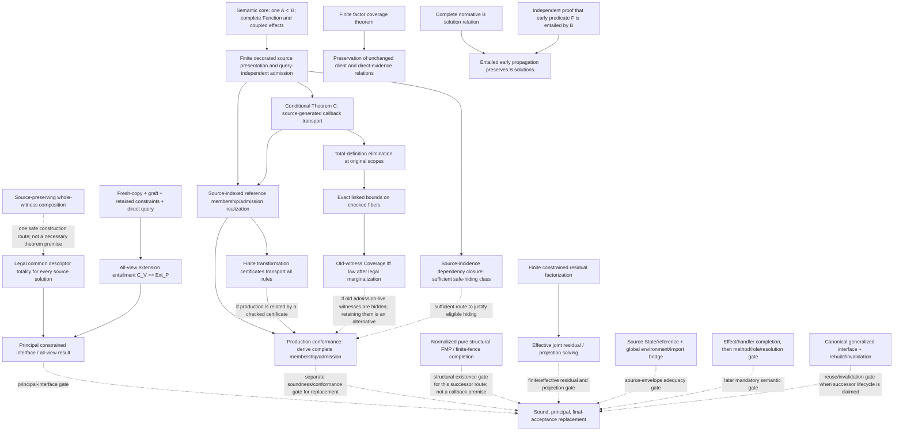

# Inference theorem and evidence dependencies

Date: 2026-10-05 snapshot
Status: Research synthesis; dependency navigation only; not an Authoritative design
Scope: Logical dependencies among current structural, callback, principality, and production results
Authority: Every node retains the scope and status of its cited source. The edge labels below distinguish theorem premises from separate obligations on the final inference-replacement objective.

Solid arrows are **logical dependencies**: the downstream result is proved using the upstream result/input in the cited construction. Dashed arrows are **parallel final-gate obligations**: the charter requires both for its end goal, but the dashed edge does not claim that one result is a premise in the proof of the other. A dashed arrow may also label an alternative proof route, which is named explicitly.

## Dependency graph

The solid-edge subgraph is the theorem-construction dependency graph. The dashed edges collect distinct workstreams required by the current replacement objective; they do not assert a proof implication among those workstreams. In particular, normalized pure FMP is a separate structural-existence gate. It is **not** a logical premise of callback endpoint membership, production conformance, common-allowance totality, or all-view extension. The overall replacement goal needs these obligations closed within its claimed envelope, but their proofs can proceed in parallel. Source-execution simulation also does not by itself account for arbitrary extras in an endpoint bound.

`RES --> EFF` means only that the residual presentation is an input to the effective joint-solving problem. The finite-residual factorization is itself conditional on stable finite guard/evidence contexts, and the effective projection of that residual together with `Phi/K,D` remains open. FMP does not close either point: it proves regular-model existence for the fixed normalized pure structural package, not an algorithm for the wider constrained package.

`FC --> PRES` is a logical implication for the theorem's stated factor presentation: complete operand coverage yields equality of the relation and therefore preserves any unchanged joint client/direct-query evidence relation. This theorem is a proof technique for a supplied decomposition, not a premise that constructs common descriptors or closes the all-view query gate.

`BREL --> AENT` is conditional on an independent entailment proof for the early predicate and retention of the complete B relation/final query. It establishes solution equality for that schedule; it does not provide a production entailment-finding algorithm or authorize endpoint copying.

`JOIN -.-> COMMON` records a sufficient proof strategy: composing whole source witnesses avoids the exhibited marginal counterexamples. It is not a necessary premise of the common-allowance theorem, since another construction could preserve the same source dependencies. In either route, descriptor legality and the original totality quantifiers still need proof.

## Node ledger

| Node | Classification and exact scope | Depends on | Supersedes / strengthens | Production authority and retained implementation information |
|---|---|---|---|---|
| **SEM: endpoint query + complete Function/effects** | **Contract / semantic core.** One endpoint-dependent inequality; full callable includes role/entry and correlated ports/effects. | Approved callback/effect/concrete-compatibility decisions. | Rejects concrete-success composition and value-only shadows. | Governs target semantics, but not by itself a compiler implementation plan. Preserve role, complete port/effect coupling, occurrence, scope, and witnessed adaptation/subtraction evidence. |
| **SRC: finite decorated source presentation** | **Conditional theorem package / draft adequacy target.** Finite immutable source envelope; same assignment, owners, roots, request/resumption paths and `K,D`; query-independent admission. | SEM plus source transition/owner rules and independently valid primitive/provider relations. | Exact complete-interface embedding improves on prefix-only observations; does not prove the finite production presentation. | No production conformance authority. Keep old source tuple, binder tree, source owner/provider incidence, scopes and typed paths available in the proof/presentation. |
| **C: Theorem C** | **Conditional theorem.** Explicit positive generator, shared-body total-coordinate lift, independent challenge admission, fixed joint `nu,K,D`, Pure value with actual Value entry. | SRC envelope and hypotheses in theorem §§2–4. | Establishes callback checked-domain inclusion and actual-to-checked bound inclusion for this generated pair. | Reviewed math only. Requires original tuple and shared witnesses; not arbitrary effects, mutable state, imports, every source form, nor current production. |
| **REF: source-indexed realization** | **Theorem for constructed reference interpretation.** Finite membership and punctured-context admission constructors; whole observation projected once. | C and source-indexed constructor rules, independently supplied primitive/provider relations. | Turns theorem-level correspondence into explicit finite reference rules; does not choose the production denotation. | No implementation authority. Existing `Rel_C` can express reference; preserve source labels, occurrence, tuple, root, body/consumer, receipt, path and `nu,K,D`. |
| **CERT: finite transformation transport** | **Conditional theorem.** Complete alpha/graft/scoped-hide/rewrite/allocation-sharing/equality-quotient certificate covering all rules and roots. | REF-like full presentation, supplied primitive transport laws and finite checked certificate. | Replaces informal matching of four ports/executed examples with whole-membership and independent-admission transport for certified presentations. | No compiler emission format or authority. Must retain maps, scope, rule coverage, occurrence/provider incidence and fixed-point interpretation. |
| **TD: total-definition elimination** | **Theorem.** Fresh total derived coordinates can be removed at original scopes; old witness/admission certificate remains. | Theorem C's definition lift; source binder tree and total, scope-legal definitions. | Removes uniform-admission requirement for newly defined total coordinates. Does not permit forgetting old admission-live witnesses. | Metatheoretic only. Preserve old shared tuple and binder dependencies; no extra semantic carrier follows. |
| **EQ: checked-fiber equality** | **Theorem.** Exact linked actual/checked reference bounds equal for every checked-admitted complete challenge. | TD, exact root alternatives and complete observation projection. | Strengthens earlier inclusion for the specified linked pair; not all independently conservative checked bounds or domain equality. | No production authority until linked to production endpoints. Retain complete observation and common challenge/fiber. |
| **COV: old-witness Coverage** | **Theorem (necessary and sufficient for the specified pair after legal marginalization).** Every actual complete observation at checked challenge has a checked-admitted old-witness representative at the same observation/challenge and permitted scope. | EQ and legal existential marginal setup; unchanged rigid binder order. | Refines admission-uniform hiding; uniformity is sufficient but stronger. | No source-wide automatic guarantee. Either retain admission-live old coordinates or establish Coverage. Preserve original owners, request/continuation, path and shared fiber. |
| **HIDE: source dependency closure** | **Conditional theorem / sufficient class only.** An old existential outside conservative finite admission dependency closure has uniform admission. | Source admission certificates and proof that exposed request/provider was produced and retained. | Makes safe hiding derivable for eligible complement; does not claim closure is minimal or nonempty. | Production extraction remains open. Preserve certificate inputs and production/retention evidence. |
| **FC: factor coverage** | **Theorem; uniform converse conditional.** For `T={x in Omega | all_i A_i(x|E_i)}`, `Cover(E,B)` implies the join of projections reconstructs exactly `T`. Under the stated independent nontrivial product-domain premise, coverage is necessary for a guarantee uniform over all factor relations. | A supplied factor/operand presentation and proposed retained bags. | Sharpens source-preserving composition into a finite sufficient certificate; a fixed XOR/provider witness refutes all proper-marginal reconstruction for that source context. It does not imply every individual relation needs coverage. | Metatheoretic certificate only; no descriptor formation rule or production marginalization authority. Retain whole factor interfaces, outer scope, shared old coordinates, provider/request and admission incidence. |
| **PRES: complete-use preservation** | **Theorem.** If `T'=T` by a checked exact factor-cover reconstruction, then `T' ∧ H` and `T ∧ H` have identical solution/evidence relations for any unchanged client/direct-query relation `H`. | FC or any separately proved exact equality of the whole source relation; unchanged scopes and designated export/query. | Removes a separate query-preservation proof for the same certified rewrite. Does not prove query existence, resolver completeness for independently valid views, or legal common-component substitution. | No production authority beyond a supplied checked equivalence. Preserve client, residual, method/adapter and direct-query evidence relations unchanged. |
| **BREL: complete normative B relation** | **Contract / theorem input.** B retains independently synthesized endpoints and the completed ordinary query, with every solution/evidence alternative. | Authoritative callback-literal source contract. | Defines the relation against which any A scheduling optimization is compared. | Production generation remains unimplemented; retain the completed B relation and query. |
| **ENT: early-predicate entailment** | **Conditional theorem hypothesis.** A separate proof establishes `S_B => F` for the proposed early predicate. | Complete B relation and an independent entailment argument. | No general production method for discovering such `F` is established. | Must retain the proof dependency and every B alternative; endpoint copying is not an entailment proof. |
| **AENT: entailed early scheduling** | **Conditional theorem.** If ENT holds and B is retained, adding `F` preserves every full B solution, including alternatives and final-query evidence. | BREL and ENT. | Generalizes the bounded A/B scheduling characterization to arbitrary domains. Does not derive `F` or justify dropping B witnesses/query after projection. | No production algorithm or implementation authority. Preserve all B endpoint choices, method/adapter/residual/evidence alternatives and final complete query. |
| **PROD: production conformance** | **Open.** Every actual production membership and independent admission has source-factorization/certificate; every checked membership embeds; B generation separately conforms. | Logical inputs: a source-indexed reference target and a complete production-to-reference argument (possibly via a checked certificate). If the production proof hides old admission-live witnesses, then Coverage or a separate hiding proof is needed; retaining those witnesses is an alternative. Current HIR/lowering, ConstraintStore and complete Function/effect semantics are the conformance subject. | No result supersedes this gate. Source simulation alone is weaker because it omits extra endpoint members. | Required before production inference cutover. Preserve all live ConstraintStore/provenance/source owner/row links. Current Apply/inline lambda generation is absent; draft has no implementation authority. |
| **FMP: finite-fence completion** | **Theorem, classification A.** Fixed normalized pure structural package satisfiability has a permitted regular graph model, at most `8^N`, with exact descriptors, Record width, variance, invariants and arbitrary rigid permission sets; finite quotient conflict reflection/BR close. | Pure structural package and proof's quotient/profile construction. | Supersedes unrestricted pure-FMP open status and the need for a source regularity premise. Does not absorb guards, `K,D`, effect semantics or production adequacy. | Mathematical theorem only; checker is characterization. No production algorithm selected. Preserve joint constraints while normalizing; theorem does not license dropping non-pure conjuncts. |
| **RES: finite constrained residual** | **Conditional factorization candidate / open source premises.** Finite normalization retains flexible-head comparisons, guards and original `Phi`; solution-set factorization holds under stable finite evidence-context conditions. | Scoped rational equality quotient, fixed normalized structural clauses, and source proof that comparison contexts remain finite/stable. | Strengthens closed-head normalization into a constrained residual presentation; does not establish satisfiability/effective solving or public schemes. | No implementation authority. Preserve bound identity, guard/evidence context, endpoint identity, scope, and correlated `Phi/K,D`. |
| **EFF: effective joint solving/projection** | **Open.** Decide or effectively represent finite residual obligations together with structural projection and original joint `Phi/K,D`; prove principal/effective public projection. | RES plus any separately needed regular witnesses; source/role/effect rules and joint projection semantics. | Not implied by FMP's existence theorem or by solution-set factorization alone. | Production path not selected. Keep one shared assignment and all constrained interfaces/evidence; do not solve bounds independently and reconstruct marginals. |
| **USE: ordinary constrained-use construction** | **Conditional theorem.** Fresh copy, optional supplied uniform graft, client constraints, direct complete query at designated export. | Finite presentation, graft legality, ordinary direct-query syntax. | Removes need for a separate explicit `m_V` map-construction calculus when direct query remains. | The finite graph is constructible, but solution completeness still conditional. Keep the direct query and actual export root. |
| **EXT: all-view extension entailment** | **Open criterion.** For every independently valid public view, `C_V(v) => Ext_P(v)` through actual designated root. | USE plus complete Function query/resolver adequacy and legal descriptor graft. | Makes exact residual of all-view use explicit; map machinery is unnecessary for the retained-query route, not the obligation itself. | No production authority. Preserve client constraints, designated exported root and resolver evidence; replacement root needs its own direct comparison. |
| **JOIN: source-preserving composition** | **Counterexample / obstruction + valid composition principle.** Independent marginals can lose source witness/provider incidence; composing whole source witness first preserves it. | Source relation composition, request/provider origins and approved whole-observation projection. | Refutes stage-wise/type-only joins and local representative substitution in exhibited source models. | No general common-descriptor construction. Preserve returned-provider and request/continuation incidence, old tuple, then project once. |
| **COMMON: common descriptor totality** | **Open.** `forall xi. forall s in S_xi. exists a. Q_xi(s,a)` with one legal source-expressible complete descriptor and direct whole-Function queries. | Accepted principal criteria, source-generation of role-indexed complete Function view, and coupled effect interpretation. Whole-witness composition is one safe construction route, not a theorem premise if another route preserves the required source dependencies. | Supersedes earlier explicit-`m_V` machinery as the key current residual, but not the common descriptor existence obligation. | No production authority. Need not add independent effect contributor rows or guessed selectors; descriptor realization and all dependencies remain open. |
| **PRIN: principal constrained interface** | **Open.** Common allowance totality plus all-view direct-query completeness and adequacy. | Logical composition: COMMON and EXT discharge distinct clauses of principality once the relevant presentation/use relations are defined. Production adequacy supplies the source-facing relation to which the public result applies. FMP is not a lemma in either callback or common-allowance proof; it is a separate structural-existence obligation in the replacement program. | No unrestricted theorem yet. | No production cutover. Preserve generalized constrained relation, all joint bounds/effects/scopes and evidence sufficient for future uses. |
| **LIFECYCLE: rebuild/invalidation** | **Authoritative lifecycle boundary, representation details open.** Rebuild changed inference component; reuse downstream inference only if complete generalized canonical interface unchanged. | Chosen constrained interface and proven canonical equality/dependency boundary. | Rejects a requirement for reverse-updating intrusion/SCC state across edits. | Authorizes only direction, not implementation. Define interface fields/equality, split/merge and enclosing environment, atomic publication, non-inference artifact invalidation. |
| **STATE: source State/reference and global bridge** | **Open.** Dynamic ownership, read/update replacement, captured access, repeated resumption, first-class references/imports, and complete `EnvStore`/`JointWF` source realization. | Ordinary source computation semantics and its typed-owner/handler rules. | Separate from the immutable callback envelope; bounded restart probes are characterization only. | Required wherever the claimed source envelope includes these constructs. Preserve live-store identity, dynamic event/owner identity and re-entry evidence. |
| **RESOLVE: effect/handler, then method/role/resolution gate** | **Open mandatory source-semantic gate.** Ordinary effect/handler meaning must be settled before completion/implementation readiness; method selection, roles and implementation resolution are a later mandatory gate unless a concrete dependency forces earlier work. | Independent declarative source semantics and preservation of any retained routing/weight transformations. | Oracle routing and finite probes remain characterization, not authority. | No production implementation authority from the current theory map. Preserve weighted constraints/evidence until their meaning and transformations are proved. |

## Finite characterizations (not proof edges)

These are attached as evidence to their corresponding gates, not as arrows that prove them:

- `check_structural_fence_completion.py`: bounded validation of the finite-fence construction; its regressions record five repaired candidate bugs.
- `research_callback_admission_coverage.py`: finite coverage encodings and source-obstruction models.
- A/B relation equivalence, scoped lift, admission hiding, consumer composition, HIR `id`/`zero` trace and higher-order provider probes: finite cases only.
- Inequality endpoint dispatch, contract joins, and Value-vs-Computation shadow probes: finite characterization of the exact local distinction stated by each record.

See the per-probe links in [the theory map](inference-theory-map.md) and [design index](../design/INDEX.md). A passing run cannot upgrade a node's classification.

## “What closes if this is solved?”

The current charter targets soundness, principality, and final well-typed-program capability for a stated source envelope. Treat these as parallel proof obligations on the final theorem, not as an invented chain in which FMP proves production conformance or principality. The complete milestone also retains separate finite-residual/effective-projection, source State/reference/global-environment, ordinary effects/handlers, and later method/role/resolution gates. Some proofs can share definitions or lemmas, but no such implication is claimed here.

| Open item solved | Consequence | Still open afterward |
|---|---|---|
| Production membership/admission factorization | Closes the callback production crosswalk for the covered source envelope, once every root alternative and independent admission rule is covered. | Common descriptor totality, all-view direct query, broader source/effect envelope, and pure structural FMP as a separate gate. |
| Coverage for every hidden admission-live old witness (or retain it) | Closes the old-witness marginal step for that exact production presentation. | Production constructor/certificate derivation and principality. |
| Legal common descriptor for each original solution | Closes `forall xi,s exists a Q` for the stated envelope. | All-view `C_V => Ext_P`, source production conformance, generalization theorem, and pure structural FMP as a separate gate. |
| All-view extension entailment and resolver evidence | Closes public-use completeness for every valid finite view under the constructed interface. | Source/production adequacy and lifecycle interface equality. |
| Production source/effect adequacy + principality | Supplies the source-facing adequacy and principal-interface gates for the supported envelope. | Pure structural FMP and lifecycle/interface proof remain independently required where included in the replacement scope; then reviewed implementation design, approved cutover, implementation and separate conformance verification. |
| Finite residual plus effective joint projection | Closes only the structural constraint presentation/solver gate whose explicit premises and projection are proved. | Callback production correspondence, source State/reference, principality and final acceptance remain separate. |
| Source State/reference and global environment bridge | Closes adequacy only for the source constructs covered by its transition and ownership theorem. | Effects/handlers, method resolution, residual effectiveness, principality and implementation lifecycle remain separate. |
| Complete canonical interface and equality/lifecycle proof | Closes downstream inference invalidation/reuse boundary. | Does not close typing soundness or principality on its own. |
| Factor coverage for a proposed decomposition | Closes exact reconstruction and preservation of all unchanged client/evidence relations for that one decomposition. | Legal descriptor formation, common allowance, all-view query existence, production factor inventory and the broader callback/principality gates remain open. |

## Principal dependency documents

[Finite-fence completion](../design/2026-10-04-structural-fmp-fence-completion.md); [source-generated callback theorems](../design/2026-10-04-source-generated-callback-structural-theorems.md); [source-indexed realization](../design/2026-10-04-source-indexed-callback-realization.md); [certified transport/use](../design/2026-10-04-certified-callback-and-constrained-use.md); [coverage/source joins](../design/2026-10-05-callback-coverage-and-source-joins.md); [factor coverage and complete-use preservation](../design/2026-10-05-source-factor-cover-and-query-preservation.md); [source adequacy draft](../design/2026-10-02-source-interface-adequacy-theorem.md); [rebuild addendum](../design/2026-10-04-scc-intrusion-cross-edit-rebuild-addendum.md).
