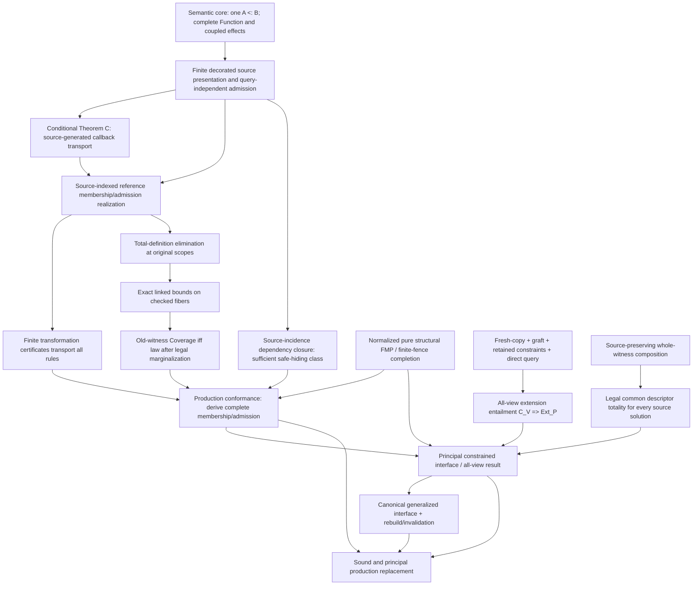

# Inference theorem and evidence dependencies

Date: 2026-10-05 snapshot
Status: Research synthesis; dependency navigation only; not an Authoritative design
Scope: Logical dependencies among current structural, callback, principality, and production results
Authority: Every node retains the scope and status of its cited source. Arrows mean “used as a premise/input or needed for the next gate,” not theorem implication beyond the cited claim.

## Dependency graph

The graph deliberately separates pure structural existence from source/effect adequacy and principal projection. FMP is not a premise that proves callback endpoint membership. Likewise source execution simulation does not by itself account for arbitrary extras in an endpoint bound.

## Node ledger

| Node | Classification and exact scope | Depends on | Supersedes / strengthens | Production authority and retained implementation information |
|---|---|---|---|---|
| **SEM: endpoint query + complete Function/effects** | **Contract / semantic core.** One endpoint-dependent inequality; full callable includes role/entry and correlated ports/effects. | Approved callback/effect/concrete-compatibility decisions. | Rejects concrete-success composition and value-only shadows. | Governs target semantics, but not by itself a compiler implementation plan. Preserve role, complete port/effect coupling, occurrence, scope, and witnessed adaptation/subtraction evidence. |
| **SRC: finite decorated source presentation** | **Conditional theorem package / draft adequacy target.** Finite immutable source envelope; same assignment, owners, roots, request/resumption paths and `K,D`; query-independent admission. | SEM plus source transition/owner rules and independently valid primitive/provider relations. | Exact complete-interface embedding improves on prefix-only observations; does not prove the finite production presentation. | No production conformance authority. Keep old source tuple, binder tree, source owner/provider incidence, scopes and typed paths available in the proof/presentation. |
| **C: Theorem C** | **Conditional theorem.** Explicit positive generator, shared-body total-coordinate lift, independent challenge admission, fixed joint `nu,K,D`, Pure value with actual Value entry. | SRC envelope and hypotheses in theorem §§2–4. | Establishes callback checked-domain inclusion and actual-to-checked bound inclusion for this generated pair. | Reviewed math only. Requires original tuple and shared witnesses; not arbitrary effects, mutable state, imports, every source form, nor current production. |
| **REF: source-indexed realization** | **Theorem for constructed reference interpretation.** Finite membership and punctured-context admission constructors; whole observation projected once. | C and source-indexed constructor rules, independently supplied primitive/provider relations. | Turns theorem-level correspondence into explicit finite reference rules; does not choose the production denotation. | No implementation authority. Existing `Rel_C` can express reference; preserve source labels, occurrence, tuple, root, body/consumer, receipt, path and `nu,K,D`. |
| **CERT: finite transformation transport** | **Conditional theorem.** Complete alpha/graft/scoped-hide/rewrite/allocation-sharing/equality-quotient certificate covering all rules and roots. | REF-like full presentation, supplied primitive transport laws and finite checked certificate. | Replaces informal matching of four ports/executed examples with whole-membership and independent-admission transport for certified presentations. | No compiler emission format or authority. Must retain maps, scope, rule coverage, occurrence/provider incidence and fixed-point interpretation. |
| **TD: total-definition elimination** | **Theorem.** Fresh total derived coordinates can be removed at original scopes; old witness/admission certificate remains. | Theorem C's definition lift; source binder tree and total, scope-legal definitions. | Removes uniform-admission requirement for newly defined total coordinates. Does not permit forgetting old admission-live witnesses. | Metatheoretic only. Preserve old shared tuple and binder dependencies; no extra semantic carrier follows. |
| **EQ: checked-fiber equality** | **Theorem.** Exact linked actual/checked reference bounds equal for every checked-admitted complete challenge. | TD, exact root alternatives and complete observation projection. | Strengthens earlier inclusion for the specified linked pair; not all independently conservative checked bounds or domain equality. | No production authority until linked to production endpoints. Retain complete observation and common challenge/fiber. |
| **COV: old-witness Coverage** | **Theorem (necessary and sufficient for the specified pair after legal marginalization).** Every actual complete observation at checked challenge has a checked-admitted old-witness representative at the same observation/challenge and permitted scope. | EQ and legal existential marginal setup; unchanged rigid binder order. | Refines admission-uniform hiding; uniformity is sufficient but stronger. | No source-wide automatic guarantee. Either retain admission-live old coordinates or establish Coverage. Preserve original owners, request/continuation, path and shared fiber. |
| **HIDE: source dependency closure** | **Conditional theorem / sufficient class only.** An old existential outside conservative finite admission dependency closure has uniform admission. | Source admission certificates and proof that exposed request/provider was produced and retained. | Makes safe hiding derivable for eligible complement; does not claim closure is minimal or nonempty. | Production extraction remains open. Preserve certificate inputs and production/retention evidence. |
| **PROD: production conformance** | **Open.** Every actual production membership and independent admission has source-factorization/certificate; every checked membership embeds; B generation separately conforms. | REF/CERT and COV or retained old coordinates; actual HIR/lowering, ConstraintStore and complete Function/effect semantics. | No result supersedes this gate. Source simulation alone is weaker because it omits extra endpoint members. | Required before production inference cutover. Preserve all live ConstraintStore/provenance/source owner/row links. Current Apply/inline lambda generation is absent; draft has no implementation authority. |
| **FMP: finite-fence completion** | **Theorem, classification A.** Fixed normalized pure structural package satisfiability has a permitted regular graph model, at most `8^N`, with exact descriptors, Record width, variance, invariants and arbitrary rigid permission sets; finite quotient conflict reflection/BR close. | Pure structural package and proof's quotient/profile construction. | Supersedes unrestricted pure-FMP open status and the need for a source regularity premise. Does not absorb guards, `K,D`, effect semantics or production adequacy. | Mathematical theorem only; checker is characterization. No production algorithm selected. Preserve joint constraints while normalizing; theorem does not license dropping non-pure conjuncts. |
| **USE: ordinary constrained-use construction** | **Conditional theorem.** Fresh copy, optional supplied uniform graft, client constraints, direct complete query at designated export. | Finite presentation, graft legality, ordinary direct-query syntax. | Removes need for a separate explicit `m_V` map-construction calculus when direct query remains. | The finite graph is constructible, but solution completeness still conditional. Keep the direct query and actual export root. |
| **EXT: all-view extension entailment** | **Open criterion.** For every independently valid public view, `C_V(v) => Ext_P(v)` through actual designated root. | USE plus complete Function query/resolver adequacy and legal descriptor graft. | Makes exact residual of all-view use explicit; map machinery is unnecessary for the retained-query route, not the obligation itself. | No production authority. Preserve client constraints, designated exported root and resolver evidence; replacement root needs its own direct comparison. |
| **JOIN: source-preserving composition** | **Counterexample / obstruction + valid composition principle.** Independent marginals can lose source witness/provider incidence; composing whole source witness first preserves it. | Source relation composition, request/provider origins and approved whole-observation projection. | Refutes stage-wise/type-only joins and local representative substitution in exhibited source models. | No general common-descriptor construction. Preserve returned-provider and request/continuation incidence, old tuple, then project once. |
| **COMMON: common descriptor totality** | **Open.** `forall xi. forall s in S_xi. exists a. Q_xi(s,a)` with one legal source-expressible complete descriptor and direct whole-Function queries. | Accepted principal criteria, source-generation of role-indexed complete Function view, coupled effect interpretation, source-preserving joins. | Supersedes earlier explicit-`m_V` machinery as the key current residual, but not the common descriptor existence obligation. | No production authority. Need not add independent effect contributor rows or guessed selectors; descriptor realization and all dependencies remain open. |
| **PRIN: principal constrained interface** | **Open.** Common allowance totality plus all-view direct-query completeness and adequacy. | PROD, FMP where structurally applicable, COMMON, EXT, generalization/use semantics. | No unrestricted theorem yet. | No production cutover. Preserve generalized constrained relation, all joint bounds/effects/scopes and evidence sufficient for future uses. |
| **LIFECYCLE: rebuild/invalidation** | **Authoritative lifecycle boundary, representation details open.** Rebuild changed inference component; reuse downstream inference only if complete generalized canonical interface unchanged. | Chosen constrained interface and proven canonical equality/dependency boundary. | Rejects a requirement for reverse-updating intrusion/SCC state across edits. | Authorizes only direction, not implementation. Define interface fields/equality, split/merge and enclosing environment, atomic publication, non-inference artifact invalidation. |

## Finite characterizations (not proof edges)

These are attached as evidence to their corresponding gates, not as arrows that prove them:

- `check_structural_fence_completion.py`: bounded validation of the finite-fence construction; its regressions record five repaired candidate bugs.
- `research_callback_admission_coverage.py`: finite coverage encodings and source-obstruction models.
- A/B relation equivalence, scoped lift, admission hiding, consumer composition, HIR `id`/`zero` trace and higher-order provider probes: finite cases only.
- Inequality endpoint dispatch, contract joins, and Value-vs-Computation shadow probes: finite characterization of the exact local distinction stated by each record.

See the per-probe links in [the theory map](inference-theory-map.md) and [design index](../design/INDEX.md). A passing run cannot upgrade a node's classification.

## “What closes if this is solved?”

| Open item solved | Consequence | Still open afterward |
|---|---|---|
| Production membership/admission factorization | Closes the callback production crosswalk for the covered source envelope, once every root alternative and independent admission rule is covered. | Common descriptor totality, all-view direct query, broader source/effect envelope. |
| Coverage for every hidden admission-live old witness (or retain it) | Closes the old-witness marginal step for that exact production presentation. | Production constructor/certificate derivation and principality. |
| Legal common descriptor for each original solution | Closes `forall xi,s exists a Q` for the stated envelope. | All-view `C_V => Ext_P`, source production conformance, generalization theorem. |
| All-view extension entailment and resolver evidence | Closes public-use completeness for every valid finite view under the constructed interface. | Source/production adequacy and lifecycle interface equality. |
| Production source/effect adequacy + principality | Supplies the proof gates needed for sound/principal inference replacement in the supported envelope. | Reviewed implementation design, approved cutover, implementation and separate conformance verification. |
| Complete canonical interface and equality/lifecycle proof | Closes downstream inference invalidation/reuse boundary. | Does not close typing soundness or principality on its own. |

## Principal dependency documents

[Finite-fence completion](../design/2026-10-04-structural-fmp-fence-completion.md); [source-generated callback theorems](../design/2026-10-04-source-generated-callback-structural-theorems.md); [source-indexed realization](../design/2026-10-04-source-indexed-callback-realization.md); [certified transport/use](../design/2026-10-04-certified-callback-and-constrained-use.md); [coverage/source joins](../design/2026-10-05-callback-coverage-and-source-joins.md); [source adequacy draft](../design/2026-10-02-source-interface-adequacy-theorem.md); [rebuild addendum](../design/2026-10-04-scc-intrusion-cross-edit-rebuild-addendum.md).
