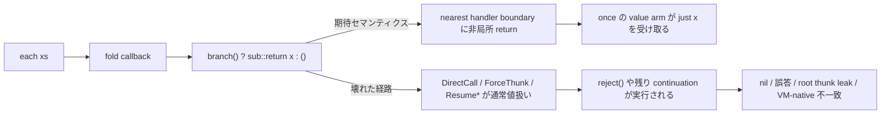

# Yulang native-undet write10 進捗レポートの深掘り分析

## Executive summary

この write10 レポートで言う「本質的な問題」は、`std::undet::each` や `.once` の個別実装バグというより、**ハンドラ本体が `sub::return` / `reject` を通じて値を返したとき、その値を通常の関数戻り値ではなく「最も近い handler 境界までの非局所脱出」として扱う必要がある**のに、途中の `fold` コールバック、`DirectCall`、`ApplyClosure`、`ForceThunk`、`Resume*`、そして Cranelift 側の内部呼び出しがその意味論を完全には共有していなかったことだと整理できるよ。`std::undet::each` は `std::flow::sub::sub` の中で `fold` コールバックから `sub::return x` で抜ける設計で、`.once` は `list<resumption>` のキューを積みながら `k true` / `k false` を探索するので、この「handler-aware な非局所 return」が崩れると `reject()` まで落ちたり、値が thunk のまま漏れたり、VM と native がずれやすい構造になっている。fileciteturn16file0 fileciteturn18file1 fileciteturn18file2

現行の `main` では、この方向の修正はかなり進んでいて、CPS evaluator には `CpsRuntimeValue::Aborted`、CPS repr evaluator には `CpsReprRuntimeValue::Aborted`、Cranelift 実行系には thread-local の abort slot と `return_if_abort_active` が入っている。加えて docs では `std::undet.each` と有限リストに対する `.once` を CPS repr 経由で通る項目として明示している。つまりレポートで見つかった核心は、**実装方針としてはもう正しかった**し、現在のコードはその方針をかなり反映している。fileciteturn16file1 fileciteturn17file0 fileciteturn17file1 fileciteturn17file2

ただし、完全に片付いたとはまだ言いにくいね。`source.rs` には `case (each [1, 2, 3]).once` を通すアクティブな比較テストがある一方で、`mk().once` のような **helper 関数 + `guard/reject` + helper 境界** を含む回帰、全候補 reject、二重 choice などは `#[ignore]` のまま残っていて、コメントでも「root thunk leak」「CPS eval returns Thunk」と明示されている。だから現状は、**直接的な `.once` の主要ケースは通るが、thunk 境界と helper 境界を跨いだ一般化は未完**、というのがいちばん正確な評価だと思う。fileciteturn18file0

私の結論はこう。短期の最優先は、今ある `Aborted` / abort-slot 路線を捨てることではなく、**その意味論を仕様として固定し、thunk 需要の挿入規則を一箇所に寄せ、ignored 回帰を CI に戻す**こと。中期では、Abort を side channel のまま持ち続けるか、CPS IR / ABI に明示的な escape を導入するかを判断すればいい。工数感としては、短期安定化は 3〜5 日、IR / ABI の明示化まで踏み込むなら 1〜2 週間くらいが妥当かな。fileciteturn16file2 fileciteturn18file0 fileciteturn17file2

## リポジトリ上の証拠と現在地

`std::undet` の設計を読むと、`each` は `sub::sub { xs.fold (): \() x -> if branch() { sub::return x } else (); reject() }` で最初の成功を外側へ飛ばす構造になっている。一方 `once` は `branch(), k -> loop(k true, append queue [k])` で resumption をキューに溜め、`reject` 時に `k false` で再開する DFS 風探索になっている。つまり `.once` の正しさは、**first-class に保存した resumption を list/tuple に入れられること**と、**value arm へ戻る経路が fold / helper / thunk の残り計算を正しくスキップすること**の両方に依存している。fileciteturn18file1

そのため現行 evaluator は、通常の `VmValue` とは別に `List` / `Tuple` / `Variant` / `Resumption` / `Thunk` / `Closure` を保持する CPS 独自値表現を持っていて、コメントにも `std::undet.once` の `list<resumption>` キューや `(k, queue)` パターンのためと書かれている。さらに `ApplyClosure` が「表面的には closure だが runtime では resumption かもしれない」ので両方を分岐して扱う仕様になっていて、これは `.once` のキューに入った continuation を後から取り出して再開する実装ときれいに対応している。CPS repr evaluator 側にも同じ方針のミラー実装が入っている。fileciteturn16file1 fileciteturn17file0

docs でも、CPS repr backend について「`std::undet.once` over a finite list」が ✅、「`std::undet.each` runs through CPS eval, CPS repr eval, and the Cranelift JIT」「handler-arm non-local returns propagate through every internal call site as `CpsRuntimeValue::Aborted` in the evaluators and as a thread-local abort slot in the Cranelift runtime」と明記されている。ここはレポートの問題認識が現行コードに反映された証拠としてかなり強い。fileciteturn17file2

一方で同じ docs には、ユーザー向け表では “Effectful thunks across function boundaries” が ❌ とされているのに、詳細ログでは「inlinable helper」「recursive helper」を跨ぐ subset が `[x]` になっている。これは**内部的には進んでいるが、サポート境界がまだ言語化しきれていない**ことを示していて、今後の不具合再発やユーザー混乱のリスクそのものだね。fileciteturn17file2

テスト面でも同じ状況が見える。`source.rs` には `compare_source_cps_repr_i64` を使って VM・CPS eval・CPS repr eval・Cranelift を突き合わせるレイヤ比較がたくさんあり、`case (each [1, 2, 3]).once` の比較テストは active になっている。その一方で、`mk().once` の「最初の choice を reject して次を拾う」「全 reject で nil」「二重 choice」などは ignore のままで、コメントがまさに `root thunk leak via helper fn with reject path` になっている。つまり、**バグ報告当時の核心はかなり掴めていて、しかも未解決の周辺ケースがいまもテスト名として残っている**。fileciteturn18file0

## 「本質的な問題」の技術的診断

この問題を一言で描くと、こうなるよ。`sub::return x` は表面上は effect operation だけれど、`sub(x)` の handler の中では「`x` を返してその handler body の残りを捨てる」挙動を取る。だから `each` の `fold` コールバックで `sub::return x` が起きたら、その後ろの `reject()` や callback の外側の continuation は走ってはいけない。ところがこの “最寄り handler 境界への脱出” が単なる通常値として流れると、周囲の `DirectCall`・`ForceThunk`・`Resume`・Cranelift helper がそのまま続きを実行してしまう。これがレポートのいう本質問題を、現行コードに引き直した形だと思う。fileciteturn16file0 fileciteturn18file1 fileciteturn18file2



理論的にも、これは effect handler の境界規則そのものの問題だね。Plotkin–Pretnar は handler を「ハンドルされた計算を別のモデルへ写す構造」として定式化していて、handler 境界が意味論上の切れ目であることを強調している。Koka の公式ドキュメントも、resumption を first-class に保存して複数回 resume できることを nondeterminism の自然な例として説明しているし、OCaml の handler ドキュメントは deep / shallow の違いを「resume 後にどの handler が dynamic scope に再び入るか」という点で説明している。Yulang の `ResumeWithHandler` や `.once` の queue はまさにこの論点の上に立っているので、今回の不具合は偶発的な if/else バグではなく、**handler scope のモデル化不備**として扱うのが正しい。日本語の研究文献でも、効果ハンドラは effect occurrence とその実装を handler 側へ分離する技法だと説明されていて、この boundary の厳密さが重要だと読める。citeturn2search3turn3search0turn2search4turn4search2

コード上の第一原因は、もともとの CPS IR に **「handler 境界へ脱出する」専用の第一級表現がない**ことだね。`Perform`、`Resume`、`ResumeWithHandler` はあるけれど、handler arm body が値を返した瞬間に「以後は通常 continuation を捨てる」と明示する terminator / effect がない。そこで現行実装は evaluator では `Aborted` を、Cranelift では thread-local abort slot を side channel として導入して埋めている。`ForceThunk` / `DirectCall` / `ApplyClosure` / `Resume` / `ResumeWithHandler` が `Aborted` を見たら即 return するのも、Cranelift で各 internal call 後に `return_if_abort_active` を入れているのも、その side channel を手で全経路へ通すためだね。動いてはいるけれど、**設計としては “明示的 IR がないので各エンジンに同じ約束を複製している”** 状態だと言える。fileciteturn16file1 fileciteturn17file0 fileciteturn17file1

第二原因は lowering の thunk 処理がかなり症状駆動になっていること。`cps_lower.rs` には `force_if_non_thunk_demand` があり、コメントでも「effectful helper が `MakeThunk + Return` に落ちるので、consumer が non-thunk を期待するときは `ForceThunk` を差し込む」「over-forcing は no-op なので safe」と説明している。これは実務的には悪くないけれど、逆に言えば **thunk か plain かの境界が lowering の複数箇所に散らばっていて、`helper 関数 + reject path + once` のようなケースではまだ漏れる** ことを示している。ignored テストのコメントときれいに一致しているね。fileciteturn16file2 fileciteturn18file0

第三原因は data / runtime environment の複雑化だよ。`.once` の queue を実現するために first-class resumption を list と tuple に保存できるようにした結果、`VmValue` では表せない CPS 専用 container が必要になり、Cranelift 側でも tuple/list/variant、handler stack、guard stack、pending/selected handler env、abort slot を thread-local で持つランタイムが増えた。これ自体は必要な進化だけれど、**セマンティクスの分散実装**を増やして drift の温床にもしている。加えて source test は 64MB stack thread で回していて、いまの native backend が CLI / 研究用の試験環境前提で、スタック特性や性能はまだ最適化フェーズに入っていないことも読み取れる。fileciteturn17file1 fileciteturn18file0

## 代替案の比較

いま選べる現実的な選択肢は、大きく三つあるよ。理論側の effect-handler 実装例を見る限り、**resumption と handler scope の境界をもっと明示する方向**ほど長期的にはきれいだけれど、現在のリポジトリはすでに `Aborted` / abort-slot 路線にかなり投資しているので、短期の安定化はその延長が最も費用対効果が高い。citeturn2search3turn3search0turn2search4 fileciteturn16file1 fileciteturn17file0 fileciteturn17file1

| 案 | 何を変えるか | 利点 | 欠点 | 複雑さ | リスク | 目安工数 |
|---|---|---|---|---|---|---|
| 現行路線の強化 | `Aborted` / abort-slot を正式仕様化し、thunk 需要挿入を一箇所へ集約、回帰テストを有効化 | 既存コードを最大限再利用。短期で効く。CPS eval / repr / Cranelift を揃えやすい | side channel が残る。実装重複は完全には消えない | 中 | 中 | 3〜5日 |
| CPS IR に明示的 `EscapeToHandler` を導入 | handler arm body return を IR 上の第一級遷移にする | 意味論が明示化され、validator も書きやすい。長期的に最もきれい | lowerer / evaluator / repr / ABI / Cranelift 全面改修 | 高 | 中 | 1〜2週 |
| ABI を tagged return 化 | 内部呼び出しの戻り値を `(status, value)` のような形にする | Cranelift 側の abort slot 依存を薄められる。runtime 観測がしやすい | ABI churn が大きい。evaluator 側との二重仕様が残りやすい | 中〜高 | 中 | 1週前後 |

短期の推奨は一番上だね。write10 レポートが見抜いた本質は正しかったし、現在の `main` もそこへ進んでいる。だから一度ここで**仕様とテストを固めてから**、それでも設計負債が大きいと判断したら IR 明示化へ移るのが安全だと思う。fileciteturn16file0 fileciteturn17file2

## 優先度付きの推奨実装

**最優先は、Abort を「実装テクニック」ではなく「CPS native backend の仕様」として固定すること。** 具体的には、`Perform` が handler arm を呼んで、その arm body が値を返したら、その値は直近 handler boundary でのみ消費され、それ以外の internal call site は必ず透過伝播する、という invariant を文書化して validator とテスト名に落とす。現行コードではその invariant が `Aborted` / abort-slot のコメントとして散っているので、ここを一枚の設計ノートにまとめるだけでも保守性がかなり変わる。依存は `cps_eval` / `cps_repr` / `cps_repr_cranelift` / docs のみで、工数は半日〜1日くらい。fileciteturn16file1 fileciteturn17file0 fileciteturn17file1 fileciteturn17file2

**次に、`force_if_non_thunk_demand` を中心とした thunk 需要処理を一箇所へ寄せること。** いまは `lower_root`、`lower_lambda`、`lower_recursive_lambda`、`lower_apply`、direct call、handled body、block 文など複数箇所で非局所的に `ForceThunk` を差し込んでいる。ここは「どの境界で force してよいか」を `ValueDemand` のような列挙にして、境界ごとに一度だけ正規化するほうがいい。これで `mk().once` 系の “helper 境界での root thunk leak” をかなり潰しやすくなるはず。工数は 2〜3 日。fileciteturn16file2 fileciteturn18file0

**その次が、ignored 回帰を CI に戻すこと。** 現在 active な `each [1,2,3].once` だけでは十分じゃない。`mk().once` 系三本、必要なら `each_list` 再帰系も含めて、少なくとも VM = CPS eval = CPS repr eval = Cranelift が揃うことを native-undet の exit criterion にするべきだね。これをしないと「docs は通ると言っているが、helper 関数を挟むとまだ不安定」という状態が続く。工数は 0.5〜1 日。fileciteturn18file0

**docs の整合性修正も早めにやったほうがいい。** “Effectful thunks across function boundaries” がユーザー表では ❌、詳細ログでは subset が `[x]` というのは、まさに今回の境界条件を見えにくくしている。ここは ❌ / △ / ✅ の意味を揃えて、「inlinable helper」「recursive helper」「helper + reject + once」は別の行に分けるのがよさそう。工数は半日未満。fileciteturn17file2

### 例示パッチ

下の diff は、そのままではなく**方向性を固めるための概念パッチ**だけれど、いまのコード形にはかなり自然に乗せられると思うよ。背景は、`ForceThunk` の挿入を scattered heuristic ではなく “需要に応じた正規化” に変える、というもの。`cps_lower.rs` には既に `force_if_non_thunk_demand` があるので、そこを発展させればよい。fileciteturn16file2

```diff
diff --git a/crates/yulang-native/src/cps_lower.rs b/crates/yulang-native/src/cps_lower.rs
@@
+enum ValueDemand {
+    Plain,
+    Thunk,
+}
+
+fn demand_from_type(ty: &runtime::Type) -> ValueDemand {
+    if matches!(ty, runtime::Type::Thunk { .. }) {
+        ValueDemand::Thunk
+    } else {
+        ValueDemand::Plain
+    }
+}
+
- fn force_if_non_thunk_demand(
+ fn finalize_value_for_demand(
     &mut self,
     value: CpsValueId,
-    expected_ty: &runtime::Type,
+    expected_ty: &runtime::Type,
 ) -> CpsValueId {
-    if matches!(expected_ty, runtime::Type::Thunk { .. }) {
+    if matches!(demand_from_type(expected_ty), ValueDemand::Thunk) {
         return value;
     }
     let forced = self.fresh_value();
     self.current.stmts.push(CpsStmt::ForceThunk {
         dest: forced,
         thunk: value,
     });
     forced
 }
@@
- let value = self.force_if_non_thunk_demand(value, &expr.ty);
+ let value = self.finalize_value_for_demand(value, &expr.ty);
```

こちらは**すぐに適用できる具体パッチ**で、未解決ケースを regression 化するもの。いま ignore のまま残っている三本は、そのまま最短の acceptance test になる。これが緑でない限り `.once` の “helper 境界込みで安定” と言わないほうがいい。fileciteturn18file0

```diff
diff --git a/crates/yulang-native/src/source.rs b/crates/yulang-native/src/source.rs
@@
-    #[test]
-    #[ignore = "Phase F: root thunk leak via helper fn with reject path; CPS eval returns Thunk"]
+    #[test]
     fn compares_std_undet_once_skips_rejected_first_choice_through_cps_repr_cranelift() {
@@
-    #[test]
-    #[ignore = "Phase F: root thunk leak via helper fn with reject path; CPS eval returns Thunk"]
+    #[test]
     fn compares_std_undet_once_returns_nil_when_all_rejected_through_cps_repr_cranelift() {
@@
-    #[test]
-    #[ignore = "Phase F: root thunk leak via helper fn with reject path; CPS eval returns Thunk"]
+    #[test]
     fn compares_std_undet_once_two_nested_choices_through_cps_repr_cranelift() {
```

最後に docs の整合性を取るパッチも入れておくとよいね。現状の内部実装と外部説明のズレが、そのまま “どこまで直ったか” の見通しを曖昧にしているから。fileciteturn17file2

```diff
diff --git a/docs/native-backend.md b/docs/native-backend.md
@@
-| Effectful thunks across function boundaries         | —                      |   ❌   |
+| Effectful thunks across function boundaries         | CPS repr (subset)      |   △   |
@@
+- `inlinable helper` と `recursive helper` の一部は通るが、
+  `helper + reject + once` の一般ケースは回帰テストを有効化するまで未確定。
```

### ロールバック戦略

この作業は段階的に戻せるように進めるのがいい。まず `Aborted` / abort-slot の仕様化とテスト追加だけを先に入れ、`ForceThunk` 正規化は別 commit に分ける。もし正規化で regressions が出たら、**Abort 伝播の修正は残したまま**、force の refactor だけ戻せばいい。ユーザー向けには docs にある通り `--run` が semantic oracle、`--native-run` も unsupported では fallback する設計なので、native backend を不安定化させずに前進できる。依存は今の比較ハーネスと docs だけで足りる。fileciteturn17file2 fileciteturn18file0

## 推奨テスト、指標、残っている制約

受け入れ条件は、個々のユニットテストが通ることより、**四層一致**で見るのがいちばんいいね。具体的には `runtime VM`、`cps_eval`、`cps_repr_eval`、`Cranelift CPS repr` が同一 root 値を返すこと。source 層にはすでに `compare_source_cps_repr_i64`、内部層には `compare_cps_module` があるので、これを使えば “どの層で壊れたか” まで追いかけられる。主要ケースは `each [1,2,3].once`、reject-first、all-reject、two-nested-choice、recursive-helper、`std::flow::sub::sub { return ... }`、mutable ref edit/update の七本くらいで十分に強い。fileciteturn18file0 fileciteturn17file2

観測指標も二種類に分けるとよい。機能指標は「一致した root 数 / 総 root 数」「ignored 回帰数」「helper 境界を含む `.once` ケースの pass 率」。内部指標は「Cranelift abort slot が root 終了時に空」「handler stack / pending env / selected env が root 終了時に空」「`ExpectedPlainValue` / `MissingHandler` / `MissingGuard` が 0」。後者は特に thread-local runtime を使っている現状では重要で、cleanup 漏れがあると次の root へ静かに汚染が飛ぶリスクがある。fileciteturn17file1

制約としては、いまの native backend は docs 自身が prototype と言っている通り、完全な本番ランタイムではない。`source.rs` のテストは大きな stack size で回しているし、Cranelift runtime は thread-local な handler stack / guard stack / abort slot を持つ設計なので、今回の話を**CLI 実験系・比較系の安定化**として扱うのが自然だね。ユーザーから与えられた条件どおり、配備環境・性能制約・期限は未指定なので、ここでは「単一 CLI 実行、正しさ優先、性能は二次」という仮定で見積もっている。fileciteturn17file2 fileciteturn18file0

最後に、この分析の限界も短く書いておくね。今回の結論は `main` の現行ソース、進捗 docs、標準ライブラリ、テスト群の証拠に強く依存していて、公開 issue は見当たらず、commit 単位の逐次タイムラインは補助的にしか使っていない。だから「何が問題だったか」と「いま何が残っているか」は高信頼で言える一方、「どの commit で完全に治ったか」の厳密な歴史記述は本報の主題から外している。とはいえ、現行コードと ignored テストの組み合わせを見る限り、優先順位はかなり明確で、**Abort 仕様の固定 → thunk 境界の集約 → ignored 回帰の CI 復帰 → docs の整合化**が最短経路だと思う。fileciteturn16file0 fileciteturn16file1 fileciteturn16file2 fileciteturn17file0 fileciteturn17file1 fileciteturn17file2 fileciteturn18file0